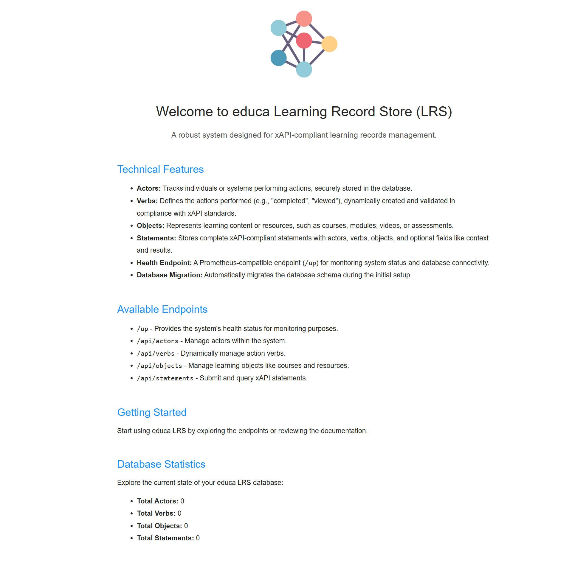

# educa Learning Record Store (LRS)

educa LRS is a robust backend system designed to collect, store, and manage **xAPI-compliant learning records**. It provides a scalable solution for tracking learning activities, supporting seamless integration with learning systems.



## Technical Features

- **Actors**: Tracks individuals or systems performing actions, securely stored in the database.
- **Verbs**: Defines the actions performed (e.g., "completed", "viewed"), dynamically created and validated in compliance with xAPI standards.
- **Objects**: Represents learning content or resources, such as courses, modules, videos, or assessments.
- **Statements**: Stores complete xAPI-compliant statements with actors, verbs, objects, and optional fields like context and results.
- **Health Endpoint**: A Prometheus-compatible endpoint (`/up`) for monitoring system status and database connectivity.
- **Database Migration**: Automatically migrates the database schema during the initial setup.
- **Swagger Documentation**: API documentation is available at `/api/documentation`.

## Swagger Documentation

Swagger documentation is an integral part of educa LRS, providing developers with a detailed and interactive view of all available API endpoints. It includes descriptions of request parameters, expected responses, and example payloads to ensure smooth integration. The Swagger UI can be accessed at `/api/documentation`.

Visit [http://localhost/api/documentation](http://localhost/api/documentation) after setting up the application to explore the API.

## Available Endpoints

| Endpoint          | Description                                    |
|-------------------|------------------------------------------------|
| `/up`             | Provides the system's health status for monitoring purposes. |
| `/api/actors`     | Manage actors within the system.               |
| `/api/verbs`      | Dynamically manage action verbs.               |
| `/api/objects`    | Manage learning objects like courses and resources. |
| `/api/statements` | Submit and query xAPI statements.              |
| `/api/documentation` | Access detailed Swagger API documentation.   |

## Running educa LRS with Docker Compose

The project includes a `docker-compose.yml` file for setting up and running the application using Docker.

### Requirements

- Docker
- Docker Compose

### Steps to Run

1. **Clone the repository:**
   ```bash
   git clone https://github.com/your-username/educa-lrs.git
   cd educa-lrs
   ```

2. **Navigate to the `sample` directory:**
   ```bash
   cd sample
   ```

3. **Start the containers:**
   ```bash
   docker-compose up -d
   ```

4. **Access the application:**
   - The application will be available at [http://localhost](http://localhost).
   - The swagger documentation can be accessed at [http://localhost/api/documentation](http://localhost/api/documentation)

5. **Stop the containers:**
   ```bash
   docker-compose down
   ```

### Docker Compose Services

- **`educa`**: The educa LRS System
- **`db`**: The MySQL database container.

### Customization

You can customize the database credentials and ports in the `docker-compose.yml` file to suit your environment.

## Getting Started

To start using educa LRS:

1. Clone the repository:
   ```bash
   git clone https://github.com/your-username/educa-lrs.git
   cd educa-lrs/educa
   ```

2. Install dependencies:
   ```bash
   composer install
   ```

3. Set up the `.env` file with your database configuration.

4. Run the migrations:
   ```bash
   php artisan migrate
   ```

5. Serve the application:
   ```bash
   php artisan serve
   ```

6. Visit the application in your browser: [http://127.0.0.1:8000](http://127.0.0.1:8000).

## Database Statistics

educa LRS dynamically tracks key metrics to help you understand your data:
- **Total Actors**: The number of individuals or systems tracked.
- **Total Verbs**: The total actions available in the system.
- **Total Objects**: Count of learning objects managed by the LRS.
- **Total Statements**: The total xAPI statements stored.

## License

This project is licensed under the [AGPL License](LICENSE).

---

educa LRS provides a strong foundation for xAPI-based learning systems. Start tracking learning records today!
